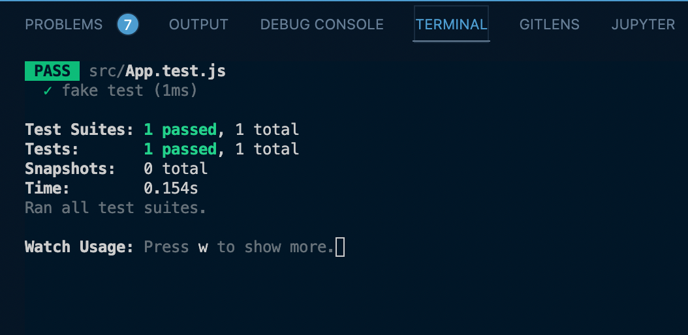
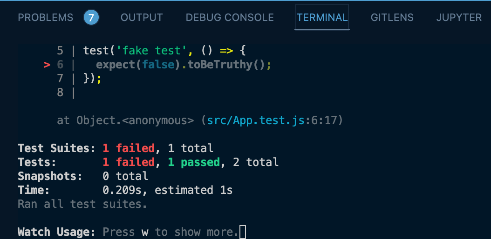
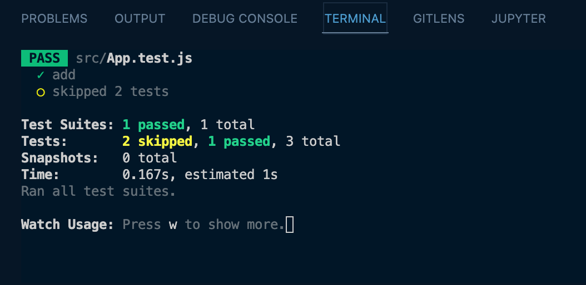
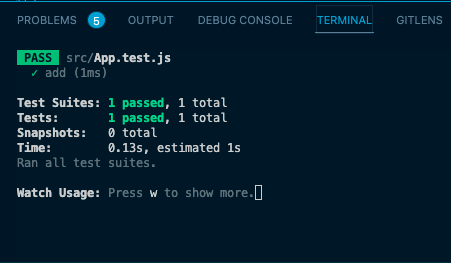
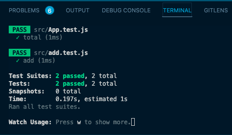
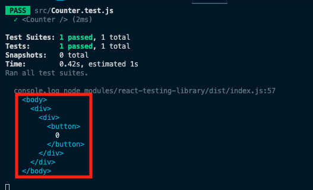
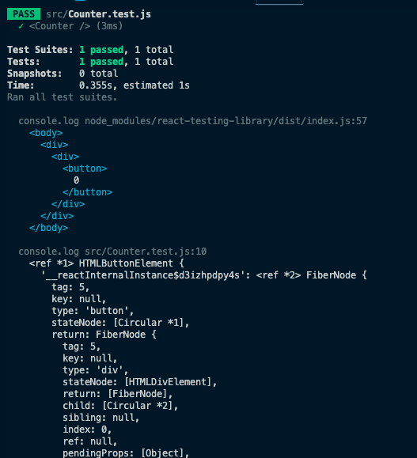
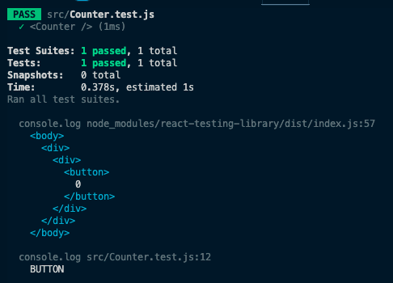
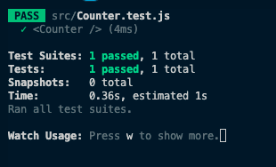
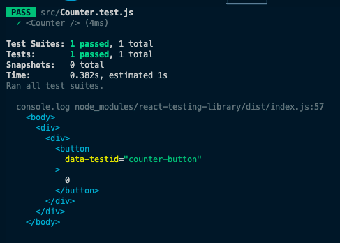

# React Testing for Beginners

[](https://testing-library.com/docs/react-testing-library/intro/)

## TOC

- [React Testing for Beginners](#react-testing-for-beginners)
  - [TOC](#toc)
  - [Jest Explained](#jest-explained)
  - [Writing Unit Tests with Jest](#writing-unit-tests-with-jest)
  - [Writing Integration Tests](#writing-integration-tests)
  - [Mock Functions & Why](#mock-functions--why)
  - [Mocking Modules](#mocking-modules)
  - [React Testing Library & Debug](#react-testing-library--debug)
  - [Testing with Test Ids](#testing-with-test-ids)
  - [Events in React Testing Library](#events-in-react-testing-library)
  - [Integration Testing in React & Cleanup](#integration-testing-in-react--cleanup)
  - [Snapshot Testing 101](#snapshot-testing-101)
  - [Spying & Mocking Functions in React](#spying--mocking-functions-in-react)
  - [Form Events With Controlled Inputs](#form-events-with-controlled-inputs)
  - [Testing for Errors & Global Mocks](#testing-for-errors--global-mocks)
  - [Negative Assertions & Testing With React Router](#negative-assertions--testing-with-react-router)
  - [What To Test](#what-to-test)
  - [Mocking Fetch](#mocking-fetch)
  - [Mocking Fetch Part 2 & Async Tests & Working With Data](#mocking-fetch-part-2--async-tests--working-with-data)
  - [Testing Loading States & More Pitfalls](#testing-loading-states--more-pitfalls)
  - [Refactoring with Tests](#refactoring-with-tests)
  - [Code Coverage](#code-coverage)

## Jest Explained

[Jest](https://jestjs.io/)

_src/App.test.js_

```javascript
// should pass
test('fake test', () => {
  expect(true).toBeTruthy();
});

// should fail
test('fake test', () => {
  expect(false).toBeTruthy();
});
```





[top](#toc)

## Writing Unit Tests with Jest

Unit Test - should test just one thing

_src/App.js_

```javascript
export const add = (x, y) => x + y;
```

_src/App.test.js_

```javascript
import { add } from './App';

// should pass
test.skip('fake test', () => {
  expect(true).toBeTruthy();
});

// should fail
test.skip('fake test', () => {
  expect(false).toBeTruthy();
});

test('add', () => {
  // option 1
  // const value = add(1, 2);
  // expect(value).toBe(3);

  // option 2
  expect(add(1, 2)).toBe(3);
  expect(add(2, 5)).toBe(7);
});
```



[top](#toc)

## Writing Integration Tests

Tests where one unit interacts with another unit

_src/App.js_

```javascript
export const add = (x, y) => x + y;

export const total = (shipping, subTotal) => `$${add(shipping, subTotal)}`;
```

_src/App.test.js_

```javascript
import { add, total } from './App';

test('add', () => {
  expect(add(1, 2)).toBe(3);
  expect(add(2, 5)).toBe(7);
});

// integration test b/c not only testing total function but also the add function and its output to total function
test('total', () => {
  expect(total(5, 20)).toBe('$25');
});
```

[top](#toc)

## Mock Functions & Why

- mock a function that may not be accessable to the current test but an assertion relies on what comes back from that function in order to test what it needs to test in the function it is designed to test
  - mock api calls
  - mock database calls

_src/App.test.js_

```javascript
import { total } from './App';

const add = jest.fn(() => 3); // mocking the add function

test('add', () => {
  expect(add(1, 2)).toBe(3);
  expect(add).toHaveBeenCalledTimes(1);
  expect(add).toHaveBeenCalledWith(1, 2);
});
```



[top](#toc)

## Mocking Modules

- mock the import and then mock the implementation of what we mock imported

_src/add.js_

```javascript
export const add = (x, y) => x + y;
```

_src/add.test.js_

```javascript
import { add } from './add';

// unit test

test('add', () => {
  expect(add(1, 2)).toBe(3);
  expect(add(2, 5)).toBe(7);
});

```

_src/App/js_

```javascript
import { add } from './add';

export const total = (shipping, subTotal) => `$${add(shipping, subTotal)}`;
```

_src/App.test.js_

```javascript
import { total } from './App';
import { add } from './add';

jest.mock('./add', () => ({
  add: jest.fn(() => 25),
}));

test('total', () => {
  expect(total(5, 20)).toBe('$25');
  expect(add).toHaveBeenCalledTimes(1); // spy on add function

  // Redundant
  add.mockImplementation(() => 30);

  expect(total(5, 25)).toBe('$30');
  expect(add).toHaveBeenCalledTimes(2); // spy on add function
});
```



[top](#toc)

## React Testing Library & Debug

> NOTE: `Counter.js` is not really used in the actual app,
> just demonstrate some basic React-Testing-Library
> principles.

_src/Counter.js_

```javascript
import React, { Component } from 'react';

export default class Counter extends Component {
  state = {
    count: 0,
  };

  render() {
    const { count } = this.state;
    return (
      <div>
        <button>{count}</button>
      </div>
    );
  }
}
```

_src/Counter.test.js_

```javascript
import React from 'react';
import { render, cleanup } from 'react-testing-library';
import Counter from './Counter';

test('<Counter />', () => {
  const wrapper = render(<Counter />);
  wrapper.debug();
});
```

Output from line 7 of `Counter.test.js`



- easy way to get some visibilty on our `<Counter />` component
- if you added `console.log(wrapper.getByText('0'));` inside the callback of the test function, the following output in the console would be the actual DOM node.



- from here you can then add on something like `console.log(wrapper.getByText('0').tagName);` and get:



_src/Counter.test.js_

```javascript
import React from 'react';
import { render, cleanup } from 'react-testing-library';
import Counter from './Counter';

test('<Counter />', () => {
  const wrapper = render(<Counter />);

    expect(wrapper.getByText('0').tagName).toBe('BUTTON');
});
```



[top](#toc)

## Testing with Test Ids

One of the big differences between using React-Testing-Library and a third-party library such as Enzyme (Enzyme is no longer going to be kept up after React 17) is in Enzyme you could lookup a component by the component name.  Sounds great and easy, however, users don't know the component name or interact with the component directly.  In React-Testing-Library you look up an element just as it is in the DOM.  This is how a user interacts with your app, through the DOM.  And you should test your app the way a user will interact with it.

_src/Counter.js_

```javascript
import React, { Component } from 'react';

export default class Counter extends Component {
  state = {
    count: 0,
  };

  render() {
    const { count } = this.state;
    return (
      <div>
        <button data-testid='counter-button'>{count}</button>
      </div>
    );
  }
}
```

> NOTE: if you happen to see in VSCode red underlines under the keywords **test** and **expect**, then you can add those as globals in the your `.eslintrc.js` file.

```javascript
...},
globals:{
  test: true,
  expect: true
}
```

- refactor `Counter.test.js` file to below.
    - destructure out `debug` and `getByTestId` from the `<Counter />` component
    - `const { debug, getByTestId } = render(<Counter />);`
    - now have access to `debug` and `getByTestId` directly


_src/Counter.test.js_

```javascript
import React from 'react';
import { render, cleanup } from 'react-testing-library';
import Counter from './Counter';

test('<Counter />', () => {
  // Renders component
  const { debug, getByTestId } = render(<Counter />);

  debug(); // not needed to test, just handy

  // Asserts counter-button is a button
  expect(getByTestId('counter-button').tagName).toBe('BUTTON');
  // Asserts counter-button starts at 0
  expect(getByTestId('counter-button').textContent).toBe('0');
});
```



[top](#toc)

## Events in React Testing Library

[top](#toc)

## Integration Testing in React & Cleanup

[top](#toc)

## Snapshot Testing 101

[top](#toc)

## Spying & Mocking Functions in React

[top](#toc)

## Form Events With Controlled Inputs

[top](#toc)

## Testing for Errors & Global Mocks

[top](#toc)

## Negative Assertions & Testing With React Router

[top](#toc)

## What To Test

[top](#toc)

## Mocking Fetch

[top](#toc)

## Mocking Fetch Part 2 & Async Tests & Working With Data

[top](#toc)

## Testing Loading States & More Pitfalls

[top](#toc)

## Refactoring with Tests

[top](#toc)

## Code Coverage

[top](#toc)
